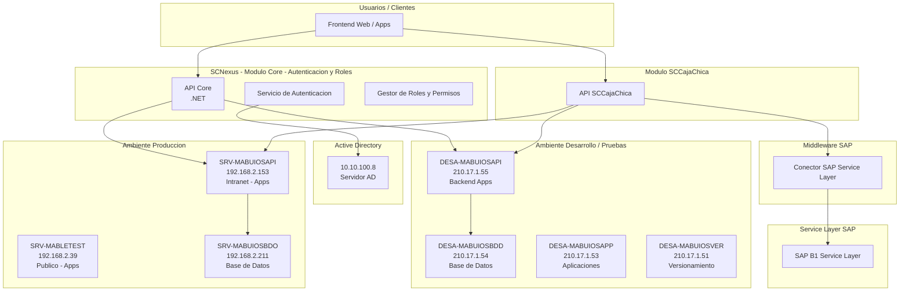

```mermaid
flowchart TB

    %% =======================
    %%  MODULO CORE
    %% =======================

    subgraph CORE[SCNexus - Modulo Core - Autenticacion y Roles]
        CORE_API[API Core<br/>.NET]
        CORE_AUTH[Servicio de Autenticacion]
        CORE_ROLES[Gestor de Roles y Permisos]
    end

    subgraph AD[Active Directory]
        AD_SERVER[10.10.100.8<br/>Servidor AD]
    end

    CORE_AUTH --> AD_SERVER

    %% =======================
    %%  MODULO CAJA CHICA
    %% =======================

    subgraph SCCaja[Modulo SCCajaChica]
        CAJA_API[API SCCajaChica]
    end

    subgraph MiddlewareSAP[Middleware SAP]
        MIDDLE_SAP[Conector SAP Service Layer]
    end

    subgraph SAP[Service Layer SAP]
        SAP_SL[SAP B1 Service Layer]
    end

    CAJA_API --> MIDDLE_SAP --> SAP_SL

    %% =======================
    %%  SERVIDORES DESARROLLO / PRUEBAS
    %% =======================

    subgraph DESA[Ambiente Desarrollo / Pruebas]
        DESA_DB[DESA-MABUIOSBDD<br/>210.17.1.54<br/>Base de Datos]
        DESA_APP[DESA-MABUIOSAPP<br/>210.17.1.53<br/>Aplicaciones]
        DESA_API[DESA-MABUIOSAPI<br/>210.17.1.55<br/>Backend Apps]
        DESA_VER[DESA-MABUIOSVER<br/>210.17.1.51<br/>Versionamiento]
    end

    CORE_API --> DESA_API
    CAJA_API --> DESA_API
    DESA_API --> DESA_DB

    %% =======================
    %%  SERVIDORES PRODUCCION
    %% =======================

    subgraph PROD[Ambiente Produccion]
        PROD_PUBLIC[SRV-MABLETEST<br/>192.168.2.39<br/>Publico - Apps]
        PROD_INTRANET[SRV-MABUIOSAPI<br/>192.168.2.153<br/>Intranet - Apps]
        PROD_DB[SRV-MABUIOSBDO<br/>192.168.2.211<br/>Base de Datos]
    end

    CORE_API --> PROD_INTRANET
    CAJA_API --> PROD_INTRANET
    PROD_INTRANET --> PROD_DB

    %% =======================
    %% CLIENTES
    %% =======================

    subgraph CLIENTES[Usuarios / Clientes]
        USER_WEB[Frontend Web / Apps]
    end

    USER_WEB --> CORE_API
    USER_WEB --> CAJA_API
```